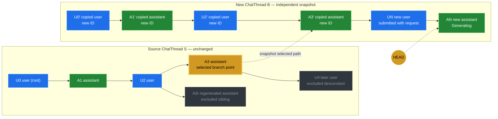
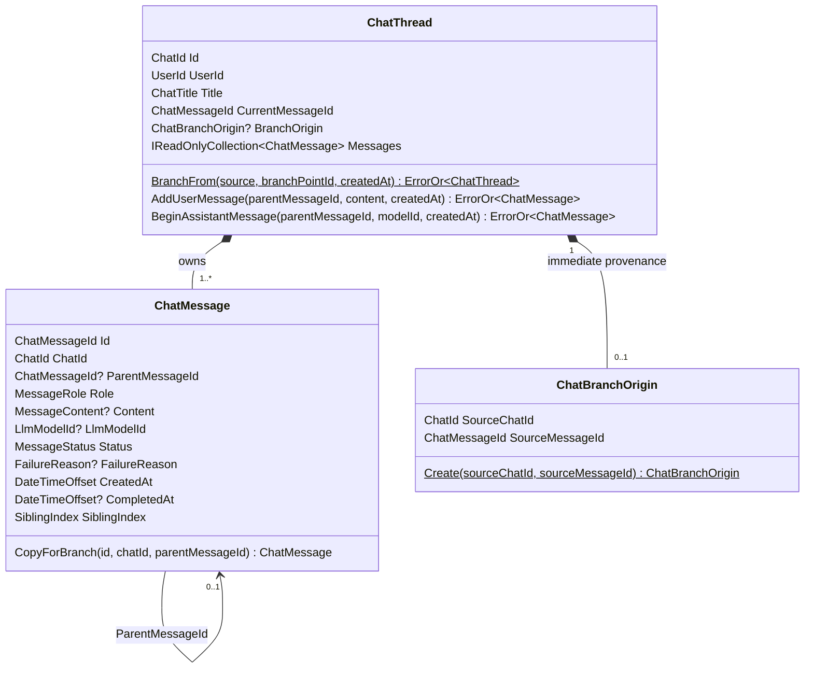
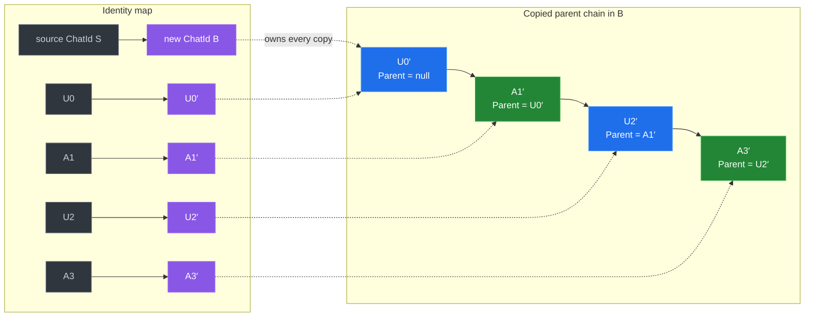
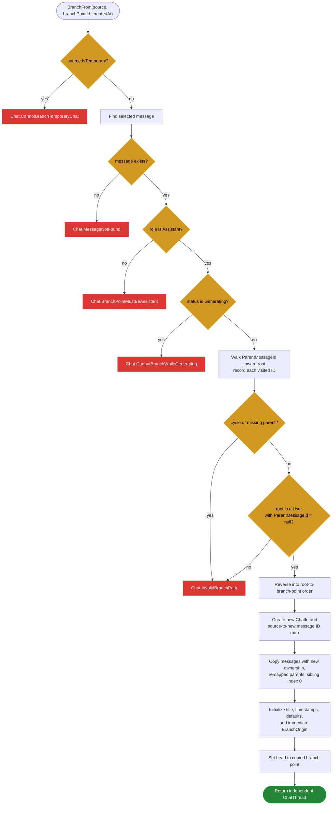
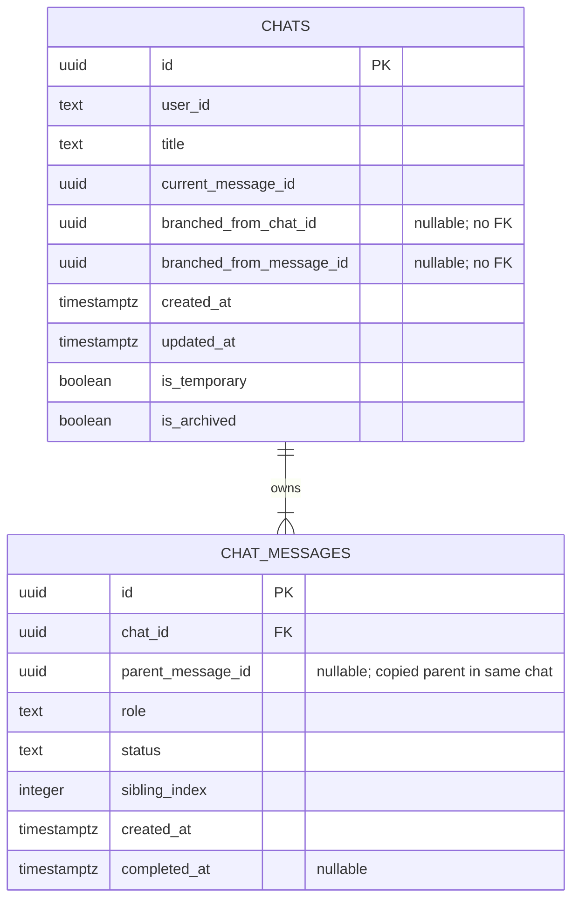
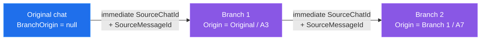

# Chat Branching Flow

How Nova's chat aggregate supports both branches inside one conversation and **Branch in new
chat**, which turns one selected conversation path into a new, independent `ChatThread`.
Companion to [the `ChatThread` aggregate diagrams](chat-thread-aggregate.md),
[the branching design](../superpowers/specs/2026-06-20-chat-branching-design.md), and
[the implementation plan](../superpowers/plans/2026-06-20-chat-branching.md).

## Two kinds of branching

Editing a user message or regenerating an assistant response creates a sibling inside the same
`ChatThread`. **Branch in new chat** crosses an aggregate boundary: it selects a terminal
assistant message, copies only that message's ancestor path, and gives the copy a new chat ID and
new message IDs.

The branch request also carries the first new user message. After the snapshot is built, that
message and a generating assistant message are appended to the new aggregate through the same
domain operations used by an ordinary conversation.



The source aggregate is only read. `SA3R`, `SU4`, and every other node outside the selected
root-to-`SA3` path stay in the source and are not copied. Once created, the new thread contains
ordinary messages and can branch internally, be edited, regenerated, or itself become the source
of another independent branch.

## Aggregate-owned snapshot model



`ChatThread.BranchFrom` owns path validation, ID remapping, metadata initialization, and head
selection. `ChatMessage.CopyForBranch` is `internal`, and `ChatBranchOrigin.Create` is also
domain-internal. Callers therefore cannot construct a half-remapped message tree or set only one
half of the source chat/message lineage pair.

The snapshot is linear at creation even when the source is a tree. That makes each copied message
the first child in its parent group, while preserving all content and lifecycle facts from the
selected source path.

## Fresh identities and remapped parents

The copy never reuses an entity identity or leaves a parent reference pointing across aggregate
boundaries. `BranchFrom` first creates the complete source-to-copy ID map, then reconstructs the
path with those IDs.



Every copied message preserves its role, content, model ID, status, failure reason, `CreatedAt`,
and `CompletedAt`. Its `ChatId` becomes `B`, its `ParentMessageId` is remapped to the copied
parent, and its `SiblingIndex` becomes `SiblingIndex.First()`. The copied `A3′` becomes the new
thread's initial `CurrentMessageId`; the handler then advances the head as it appends the new turn.

## `BranchFrom` guards and snapshot algorithm

Only a non-temporary chat and a terminal assistant message can produce an independent branch.
The ancestry checks also protect the operation from malformed persisted trees before any new
aggregate is returned.



`Completed` and `Failed` assistant messages are both terminal and copyable. A failed assistant
keeps its failure reason and completion timestamp. A generating assistant is rejected because its
state is still changing and cannot be a stable snapshot boundary.

The new thread receives the source owner, a bounded `Branch: {source title}` title, branch-time
`CreatedAt`/`UpdatedAt`, no pin, and a non-archived state. The current implementation forbids a
temporary source, so a successfully created branch is non-temporary.

## End-to-end branch request

The final implementation uses a dedicated FastEndpoints route rather than optional branch fields
on normal chat creation:

```http
POST /v1/chats/{sourceChatId}/messages/{sourceMessageId}/branches
```

The body supplies the first new message, model ID, and generation options. The response is the
same turn-start shape used elsewhere, but every returned ID belongs to the new chat.

```mermaid
sequenceDiagram
    actor Browser
    participant API as BranchChat FastEndpoint
    participant H as BranchChatHandler
    participant MC as Model catalog
    participant R as Chat repository
    participant CT as ChatThread
    participant BUS as MassTransit EF outbox
    participant UOW as Unit of work

    Browser->>API: POST /v1/chats/{sourceChatId}/messages/{sourceMessageId}/branches<br/>{ message, modelId, forceUseSearch }
    API->>H: Send BranchChatCommand through Mediator
    H->>H: Validate user and value objects

    alt invalid user or value objects
        H-->>API: ErrorOr errors
        API-->>Browser: 400 Problem Details
    else values are valid
        H->>MC: Ensure model is usable<br/>(and tool-capable when search is forced)

        alt model is unavailable or unsuitable
            MC-->>H: model usability errors
            H-->>API: ErrorOr errors
            API-->>Browser: mapped Problem Details
        else model is usable
            H->>R: GetSnapshotByIdAsync(sourceChatId, userId)<br/>owner-scoped, no tracking

            alt source missing or owned by someone else
                R-->>H: null
                H-->>API: Chat.NotFound
                API-->>Browser: 404 Problem Details
            else source snapshot found
                R-->>H: source ChatThread snapshot
                H->>CT: BranchFrom(source, sourceMessageId, now)

                alt domain guard fails
                    CT-->>H: MessageNotFound / conflict / invalid path
                    H-->>API: ErrorOr errors
                    API-->>Browser: 404 / 409 / 500 Problem Details
                else independent snapshot created
                    CT-->>H: new ChatThread with copied path
                    H->>CT: AddUserMessage(copied head, submitted content, now)
                    H->>CT: BeginAssistantMessage(new user ID, model ID, now)
                    H->>R: Add(new thread only)
                    H->>BUS: Publish TurnRequested(new chat ID, new assistant ID, options)
                    Note over BUS,UOW: Publish occurs first; the EF outbox buffers<br/>the job in the unit-of-work transaction.
                    H->>UOW: SaveChangesAsync

                    alt transaction fails
                        UOW-->>H: exception
                        Note over R,BUS: No branch rows or deliverable generation job commit.
                    else commit succeeds
                        UOW-->>H: aggregate + outbox entry committed atomically
                        H-->>API: TurnStartedResult(new IDs)
                        API-->>Browser: 201 Created<br/>Location: /v1/chats/{newChatId}
                    end
                end
            end
        end
    end
```

The source is loaded as a no-tracking, owner-scoped snapshot and is never added back to the
repository. Authentication therefore does not reveal whether another user's source chat exists,
and successful branching cannot dirty or save the source aggregate.

Publishing `TurnRequested` before `SaveChangesAsync` is intentional. The MassTransit EF outbox
buffers that publication in the same transaction as the new chat and its messages, preventing a
saved branch without a generation job or a deliverable job for a branch that never committed.

## Persistence and historical lineage

Copied messages use the normal `chat_messages` schema. Immediate provenance is the only new
branch-specific state: EF Core maps `ChatBranchOrigin` as two nullable columns on `chats`, while a
database check constraint preserves the value object's both-or-neither invariant.



The database enforces:

```text
(branched_from_chat_id is null) = (branched_from_message_id is null)
```

There is deliberately no foreign key from those provenance columns to the source. They record
historical origin, not aggregate ownership or a live dependency. Deleting, archiving, editing, or
switching branches in the source cannot cascade into or rewrite an already copied chat.

Each branch records only its immediate source. Repeated branching therefore forms a lineage chain
without embedding the entire history in every aggregate:



Lineage is stored for traceability and future navigation, but the current read contracts do not
expose it and the current schema does not support querying descendant branches by source. Those
features can be added later without weakening snapshot independence.

## What this model guarantees

- **Aggregate-owned reconstruction:** path validation, identity remapping, copied state, metadata,
  and the initial head are created together by `ChatThread.BranchFrom`.
- **Immutable source operation:** the owner-scoped source snapshot is read but never mutated or
  persisted by the branch flow.
- **Fresh ownership:** the chat and every copied message receive new IDs, and all parent links
  target messages inside the new aggregate.
- **Path-only copying:** siblings, alternate branches, and descendants outside the selected
  root-to-assistant path stay behind.
- **Atomic start:** copied history, the first new turn, and the MassTransit outbox entry commit in
  one unit-of-work transaction.
- **Historical provenance:** `ChatBranchOrigin` records immediate lineage without foreign-key or
  lifecycle coupling to the source.
- **Ordinary behavior afterward:** once created, the branch is a regular `ChatThread` with the
  same edit, regenerate, selection, continuation, and future branching capabilities as any other
  non-temporary chat.
