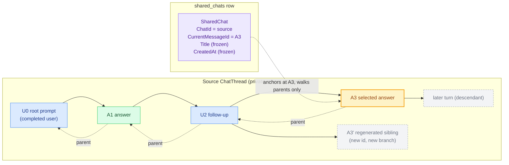
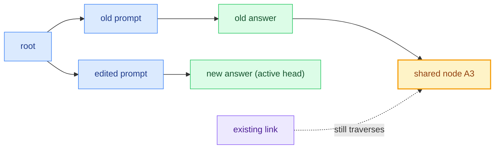
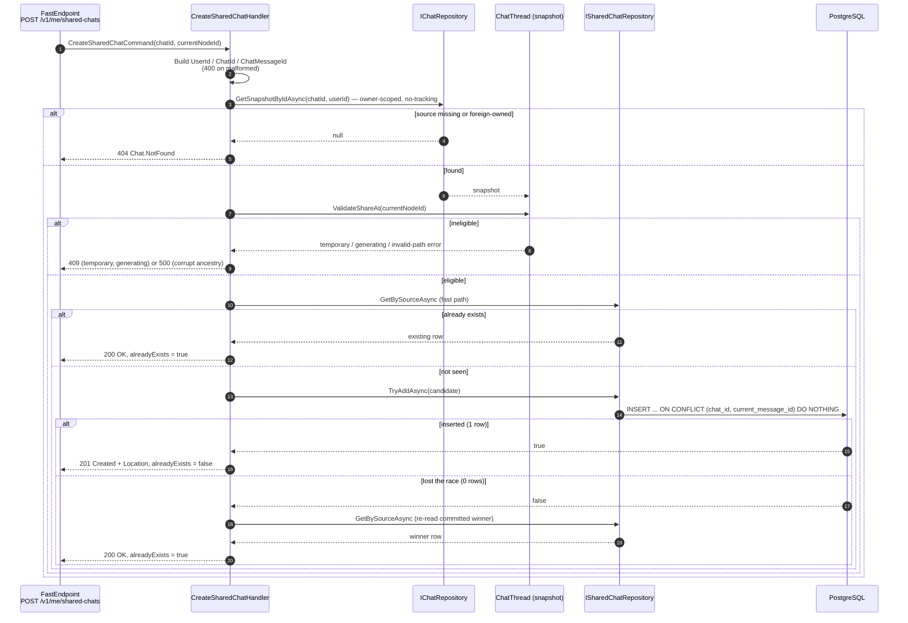
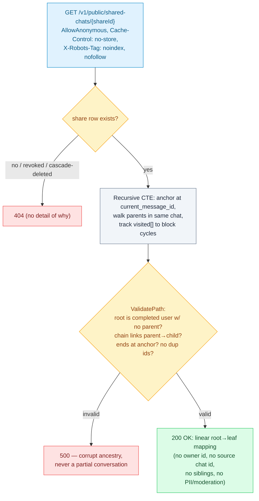
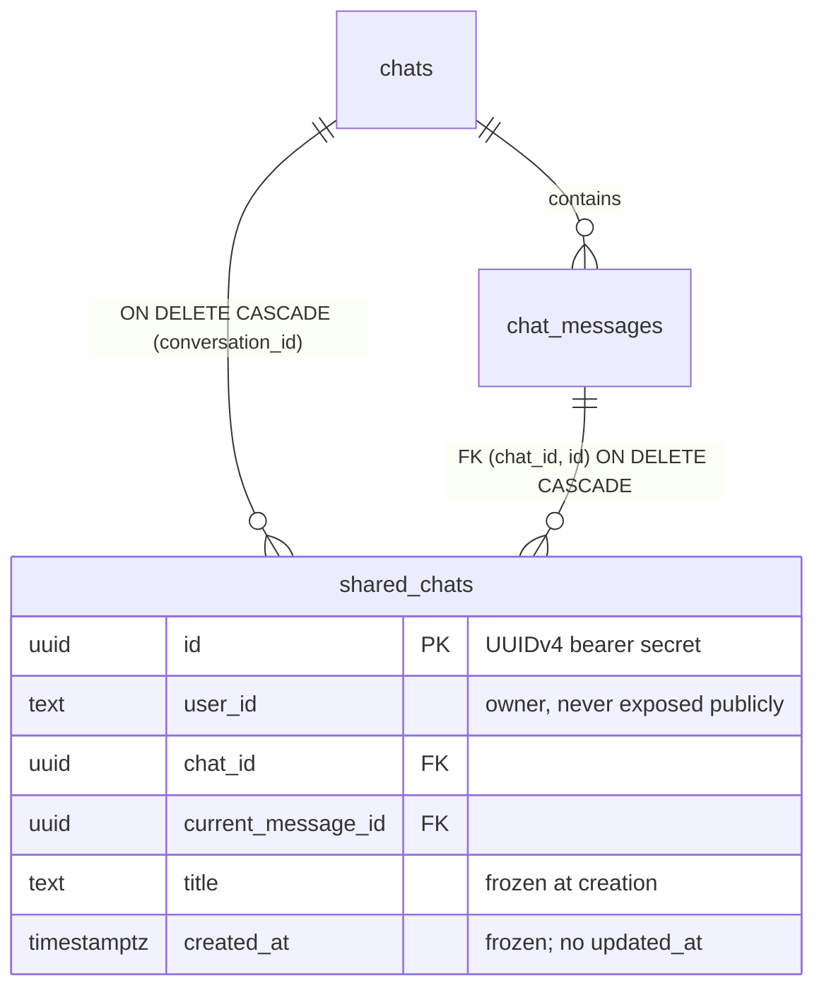
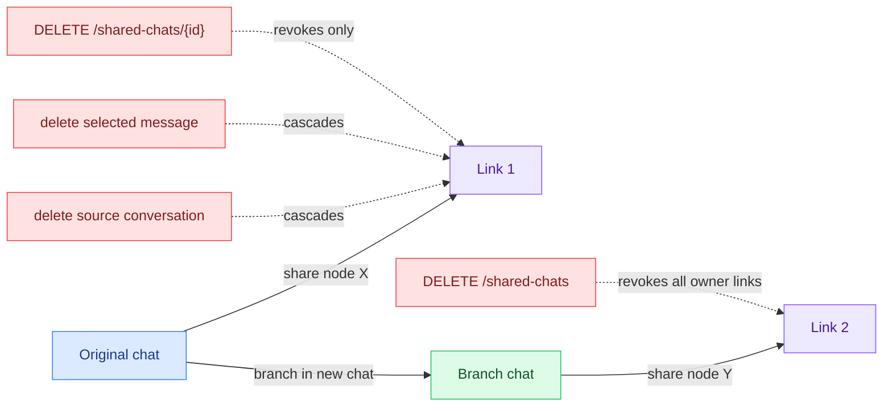

# Chat Sharing Flow

Companion to [`chat-thread-aggregate.md`](chat-thread-aggregate.md). This document explains how
Nova turns one selected point of a private chat into an anonymous, immutable public link — and
why that design stays correct and cheap as the system scales.

The source of truth is the implementation:

- `Chat.Domain/SharedChats/SharedChat.cs` — the share aggregate.
- `Chat.Domain/SharedChats/ValueObjects/SharedChatId.cs` — the bearer-secret ID.
- `Chat.Domain/Chats/ChatThread.cs` — `ValidateShareAt` eligibility guard.
- `Chat.Application/SharedChats/Commands/Create/CreateSharedChatHandler.cs` — creation flow.
- `Chat.Infrastructure/SharedChats/Repositories/SharedChatRepository.cs` — idempotent `TryAddAsync`.
- `Chat.Infrastructure/SharedChats/Readers/PublicSharedChatReader.cs` — recursive public read + validation.
- `Chat.Api/Endpoints/SharedChats/GetSharedChat/Endpoint.cs` — anonymous read with `no-store` / `noindex`.

Visual conventions follow the aggregate document: **blue** = user message, **green** = assistant
message, **amber** = the selected node / share anchor, **gray** = excluded nodes.

---

## 1. The core idea: a reference, not a copy

A share stores **one source chat ID and one selected node ID** — never copied message content.
The public reader anchors at that node and walks *parent links toward the root*. It never reads
`ChatThread.CurrentMessageId` and never follows children.

The shared view is exactly the root-to-`A3` path (`U0 → A1 → U2 → A3`). The regenerated sibling
`A3'`, the descendant `D4`, and every alternate branch are **structurally unreachable** by a
parent walk. This is why the link is immutable without copying: Nova's tree is append-only, so an
ancestor chain that existed when the link was made can never be mutated in place.

---

## 2. Why this is safe (the append-only invariant)

Editing or regenerating an old point creates a **new sibling with a new ID**; it does not rewrite
the stored node. The old branch stays persisted even after the owner UI hides it.

The link keeps showing the path it pinned. Sharing the *new* active path selects a different node
and therefore mints a *different* link. One link = one immutable `(chat, node)` pair.

> Caveat encoded in the design: if Nova ever adds **destructive** in-place editing or branch
> pruning, that operation must atomically revoke affected links or migrate them to copied
> snapshots — it must never leave a link rendering changed or incomplete content.

---

## 3. Creation — eligibility, idempotency, and the race

`ValidateShareAt` (domain) is the single eligibility gate; the repository's `TryAddAsync` is the
single source of truth for uniqueness. The application-level `GetBySourceAsync` is a fast path, not
the correctness boundary.

The unique index `(chat_id, current_message_id)` plus `ON CONFLICT DO NOTHING` makes creation
**idempotent and race-proof**: two concurrent callers for the same pair converge on one row and one
URL. `DO NOTHING` (not `DO UPDATE`) guarantees the existing title and `created_at` are never
overwritten. `SharedChatId.New()` is a random **UUIDv4**, so the public URL is an unguessable
bearer secret that leaks no creation time (unlike Nova's usual time-ordered UUIDv7).

---

## 4. Public read — recursive walk with built-in corruption defense

The anonymous endpoint runs a recursive CTE that anchors at `(chat_id, current_message_id)` and
follows `parent_message_id` *within the same conversation only*, carrying a `visited[]` array so a
corrupt cycle cannot recurse forever. The result is re-validated in code before it is returned.

Missing, revoked, and cascade-deleted links all return the **same `404`** — the response never
reveals which case occurred. The public mapping is a deliberately compact, camelCase contract that
strips owner attribution, source IDs, sibling indexes, and any moderation/PII fields.

---

## 5. Lifecycle & cascade — links never outlive their data

Referential integrity is enforced by the database, not by application bookkeeping, so a share can
never dangle or silently point at deleted content.

- **Delete one** revokes only that URL; owner-scoped (`id AND user_id`), so a foreign ID returns the
  same `404` as a missing one.
- **Delete all** is one owner-scoped statement, idempotent, `204` even with zero links.
- **Delete source conversation** cascades to every link for it.
- **Delete selected message** cascades to links anchored there (Nova has no message-delete endpoint yet).
- A revoked URL is **never** reactivated; resharing the same pair mints a fresh random ID.

---

## 6. Why it scales

| Property | Mechanism | Payoff at scale |
|---|---|---|
| No content duplication | Store `(chat_id, node_id)` reference, not messages | Sharing is O(1) storage; millions of links stay tiny |
| Immutability for free | Append-only message tree + parent-only walk | No snapshot sync jobs, no write amplification on edit/regenerate |
| Race-proof creation | Unique `(chat_id, current_message_id)` + `ON CONFLICT DO NOTHING` | Concurrent shares converge without locks held across the request |
| Cheap reads | Single recursive CTE on indexed `(chat_id, id)` / `parent_message_id` | Public read cost is proportional to path depth, not chat size |
| Owner listing | Index `(user_id, created_at DESC, id DESC)` + bounded pagination | Listing stays fast and bounded regardless of link count |
| Integrity by DB | FK cascades, not application cleanup | No orphan links, no background reconciliation |
| Stateless public path | `AllowAnonymous`, `no-store`, no source-head read | Horizontally scalable; revocation is immediate, never cached |

---

## What this model guarantees

- **Anonymous & immutable:** UUIDv4 bearer URL, no owner attribution, frozen title and timestamp.
- **Pinned, not live:** one `(chat, node)` pair; new turns, branches, and regenerations never alter
  an existing link.
- **Domain-owned eligibility:** `ValidateShareAt` rejects temporary chats, generating nodes, and
  corrupt ancestry before any row is written.
- **Idempotent creation:** the database, not the application check, is the uniqueness boundary.
- **No partial truth:** corrupt ancestry fails closed (`500`); it never renders an incomplete chat.
- **Integrity by cascade:** deleting a chat, the selected message, or the link revokes cleanly;
  revoked links never come back.
- **Opaque failure:** missing, revoked, and deleted links are indistinguishable (`404`).
