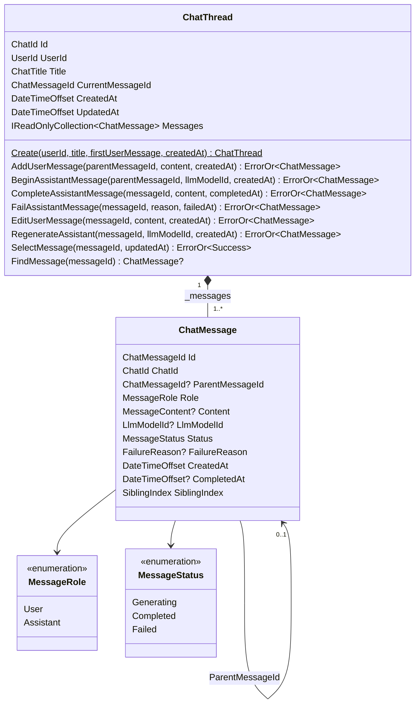
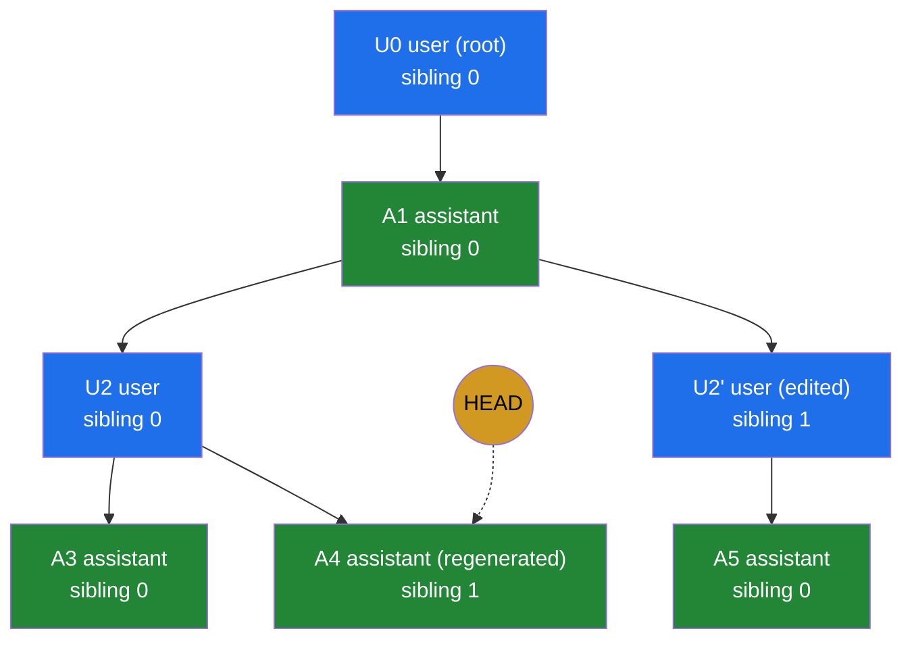
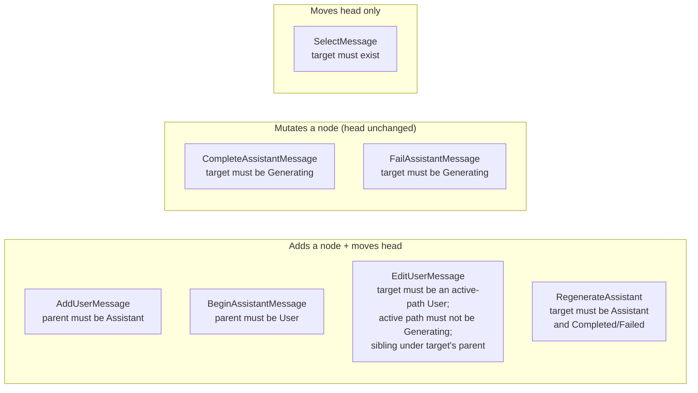
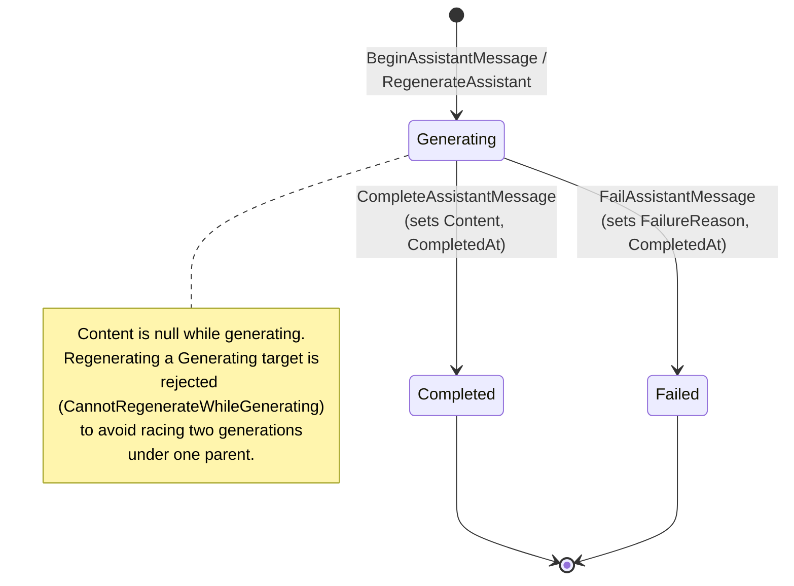
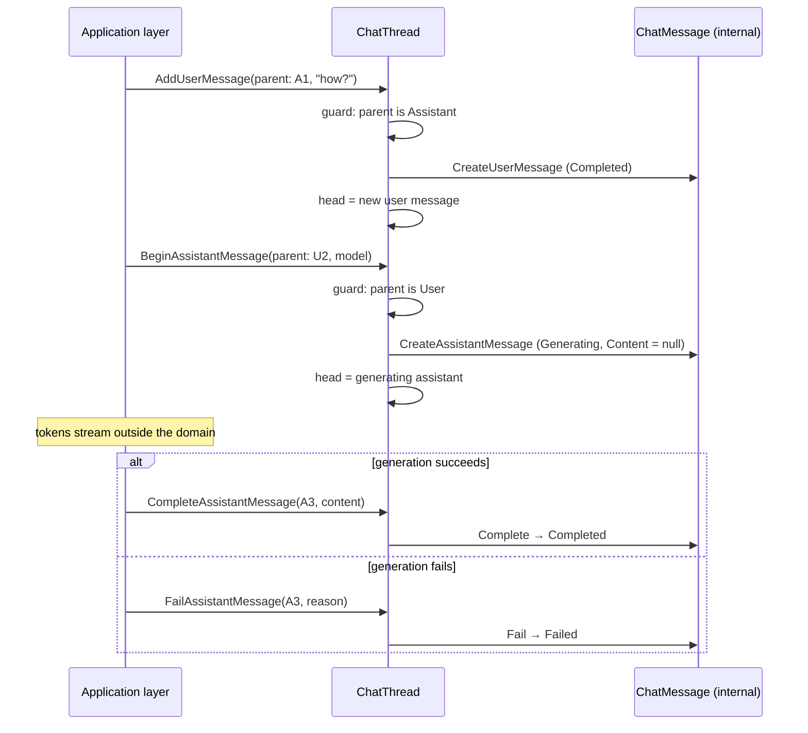

# ChatThread Aggregate

How the `ChatThread` aggregate (`src/services/Chat/Chat.Domain/Chats/ChatThread.cs`) models a
ChatGPT-style branching conversation tree. Companion to the invariants in
[the chat domain plan](../superpowers/plans/2026-06-09-chat-domain.md).

## Structure

`ChatThread` is the only aggregate root. Messages form a tree through `ParentMessageId`
(`null` = root); `CurrentMessageId` is the "head" — the active leaf the UI renders up from.

`ChatMessage` factories and state transitions are `internal`: every creation and mutation
goes through `ChatThread`, which is what makes the invariants below enforceable.

## Strict alternation and branching

Every root-to-leaf path alternates `User → Assistant → User → …`. Editing a user message or
regenerating an assistant never mutates the tree — it adds a **sibling** under the same parent
and moves the head there. `SiblingIndex` is the creation order within one parent group, which
is what the UI's `< 2/3 >` branch switcher walks.

The rendered conversation is the walk from `CurrentMessageId` up the parent links to the
root, reversed: here `U0 → A1 → U2 → A4`. `SelectMessage` moves the head to any existing
message (status-agnostic by design — during a live turn the head sits on a `Generating`
assistant).

## Guards per method

## Assistant message lifecycle

User messages are born `Completed` (`CompletedAt = CreatedAt`) and never transition.
Assistant messages stream through `Generating`; the two terminal states are one-way.
Editing is restricted to user nodes on the current root-to-head path. If that path contains a
`Generating` assistant, editing is rejected until the turn reaches `Completed` or `Failed`.
Temporary chats use the same edit behavior because they share the same aggregate model.

## A full turn

