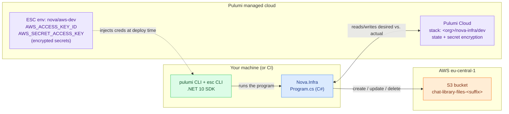
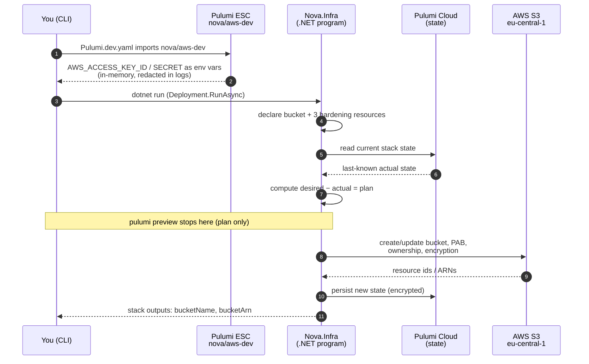
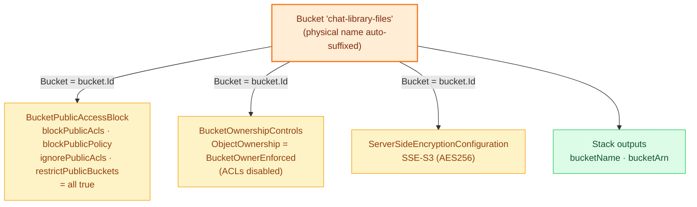
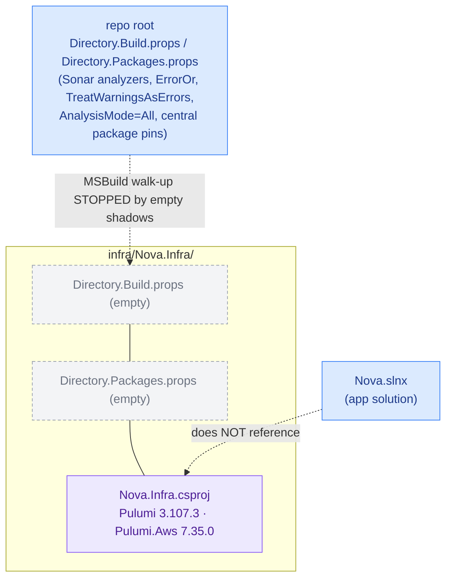
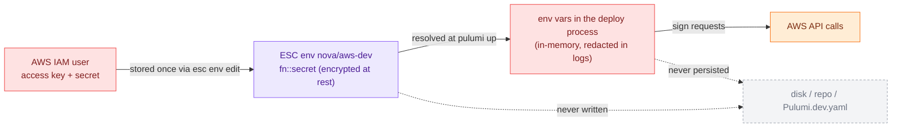

# Infra Deployment Flow

How Nova provisions its cloud footprint with **Pulumi (C#/.NET)** — where state lives, how AWS
credentials reach a deploy without ever touching disk, and why the infra project is deliberately
walled off from the application build.

The source of truth is the implementation:

- `infra/Nova.Infra/Program.cs` — declares the bucket and its hardening; returns stack outputs.
- `infra/Nova.Infra/Pulumi.yaml` — project name, `runtime: dotnet`.
- `infra/Nova.Infra/Pulumi.dev.yaml` — dev stack: imports the ESC env, pins `aws:region`.
- `infra/Nova.Infra/esc/aws-dev.yaml` — reference shape of the `nova/aws-dev` ESC environment.
- `infra/Nova.Infra/Nova.Infra.csproj` — refs `Pulumi` + `Pulumi.Aws`; not in `Nova.slnx`.
- `infra/Nova.Infra/Directory.Build.props` / `Directory.Packages.props` — intentionally empty shadows.
- `infra/Nova.Infra/README.md` — the `login → esc → preview → up → destroy` runbook.
- Design: [`../superpowers/specs/2026-07-08-pulumi-iac-foundation-design.md`](../superpowers/specs/2026-07-08-pulumi-iac-foundation-design.md).

Visual conventions: **green** = your machine / the CLI, **purple** = Pulumi managed services
(Cloud + ESC), **blue** = the .NET Pulumi program, **orange** = AWS resources, **red** = secret
material that must never land on disk or in git.

---

## 1. The three layers: who owns state, secrets, and resources

Deployment is a collaboration between four parties. Each owns exactly one concern, which is what
keeps credentials out of the repo.

- **Pulumi Cloud** is the state backend: it remembers what already exists, so `up` provisions the
  *diff*, not everything.
- **Pulumi ESC** (`nova/aws-dev`) is the key-management layer: AWS keys live here as encrypted
  secrets and are handed to the CLI as environment variables only for the duration of a deploy.
- **`Nova.Infra`** is the desired-state program — plain C# that declares resources.
- **AWS** is where the real bucket ends up. Its physical name is Pulumi-auto-suffixed because S3
  names are globally unique.

---

## 2. `pulumi up` — a single deploy, step by step

The CLI never reads a credential file. It asks ESC to resolve the environment, diffs desired state
against Pulumi Cloud, and only then calls AWS.

`pulumi preview` runs everything up to the plan and stops — no AWS mutation. `pulumi up` continues
through the apply. `pulumi destroy` runs the same machinery in reverse, deleting from AWS and
clearing the state. Because state lives in Pulumi Cloud (not on disk), any machine that can log in
and resolve ESC can reconcile the same stack.

---

## 3. The resource graph inside `Program.cs`

The program declares one bucket and three sibling resources that harden it. All three reference
`bucket.Id`, so Pulumi orders them **after** the bucket automatically — there is no explicit
`dependsOn`.

The result is a **private, encrypted, owner-controlled** bucket: no public ACLs or policies, no
cross-account object ownership, and every object encrypted at rest with AES256. Versioning is off
initially — a one-line addition if the Library feature later needs object history. The bucket is
provisioned but not yet wired to any service; it exists to hold user-uploaded "Library" files later.

---

## 4. Build isolation — why infra can't poison the app build

`Nova.Infra` deliberately inherits **none** of the app's MSBuild conventions. Two empty shadow files
stop MSBuild from walking up to the repo root, and the project is excluded from `Nova.slnx`.

Because MSBuild stops at the empty shadows, infra doesn't get the analyzers, `TreatWarningsAsErrors`,
or the central package pins the app enforces — and it declares its own Pulumi versions locally.
Because it's absent from `Nova.slnx`, `dotnet build` and app CI never pull in Pulumi packages. Infra
has its own lifecycle: it deploys independently and manually.

---

## 5. The secret path — credentials never touch disk or git

This is the whole reason ESC exists. Follow where an AWS key can and cannot go.

`esc/aws-dev.yaml` in the repo is only a **reference shape** — its values are
`REPLACE_WITH_...` placeholders, and the real keys are pasted straight into Pulumi Cloud with
`esc env edit`. `Pulumi.dev.yaml` merely *imports* the environment by name; it holds no secret. So the
repo can be public and a laptop can be wiped without leaking a credential.

---

## 6. Why it's structured this way

| Property | Mechanism | Payoff |
|---|---|---|
| No AWS keys in the repo | ESC holds creds; `Pulumi.dev.yaml` imports by reference | Repo/laptop compromise leaks nothing; rotate in one place |
| Reproducible deploys | Pulumi Cloud stores state; program declares desired state | Any authorized machine reconciles the same stack; `up` applies only the diff |
| Safe-by-default bucket | PAB + `BucketOwnerEnforced` + SSE-S3 declared alongside the bucket | Private + encrypted from creation, not a follow-up console click |
| Automatic ordering | Hardening resources reference `bucket.Id` | Pulumi sequences them after the bucket; no manual `dependsOn` |
| App build untouched | Empty shadow props + excluded from `Nova.slnx` | Pulumi packages/analyzers never enter app CI |
| Preview before apply | `pulumi preview` stops at the plan | Review the exact create/update/delete set before any AWS mutation |
| Clean teardown | `pulumi destroy` runs the graph in reverse | No orphaned AWS resources; state stays truthful |

---

## What this model guarantees

- **Declarative:** `Program.cs` describes the desired cloud state; Pulumi computes and applies the diff.
- **Secretless repo:** AWS credentials live only in ESC; the repo and disk never hold them.
- **Private by construction:** the bucket ships with public access blocked, ACLs disabled, and AES256
  encryption — not bolted on afterward.
- **Isolated lifecycle:** infra builds, versions, and deploys independently of the .NET app.
- **Reviewable & reversible:** `preview` shows the plan, `up` applies it, `destroy` unwinds it — all
  against state that lives in Pulumi Cloud, not on a single machine.
